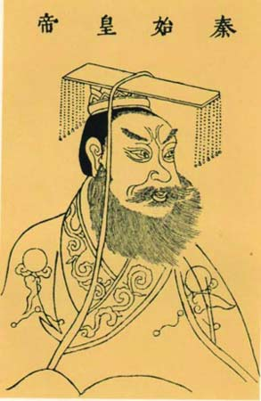
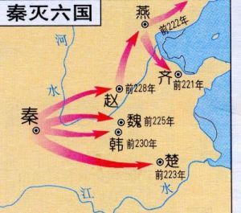

= 秦始皇
:toc: manual

== 荀子 · 《議兵》

----
齊人隆技擊，其技也，得一首者，則賜贖錙金，無本賞矣。是事小敵毳，則偷可用也，事大敵堅，則渙然離耳。若飛鳥然，傾側反覆無日，是亡國之兵也，兵莫弱是矣。是其去賃市傭而戰之幾矣。

魏氏之武卒，以度取之，衣三屬之甲，操十二石之弩，負服矢五十個，置戈其上，冠冑帶劍，贏三日之糧，日中而趨百里，中試則復其戶，利其田宅，是數年而衰，而未可奪也，改造則不易周也，是故地雖大，其稅必寡，是危國之兵也。

秦人其生民郟阨，其使民也酷烈，劫之以埶，隱之以阨，忸之以慶賞，酋之以刑罰，使天下之民，所以要利於上者，非鬥無由也。阨而用之，得而後功之，功賞相長也，五甲首而隸五家，是最為眾彊長久，多地以正，故四世有勝，非幸也，數也。 

故齊之技擊，不可以遇魏氏之武卒；魏氏之武卒，不可以遇秦之銳士。
----

== 正文

.*出生 · 即位*
----
秦始皇帝者，秦莊襄王子也。莊襄王為秦質子於趙，見呂不韋姬，悅而取之，生始皇。以秦昭王四十八年正月生於邯鄲。及生，名為政，姓趙氏。年十三歲，莊襄王死，政代立為秦王。當是之時，秦地已并巴、蜀、漢中，越宛有郢，置南郡矣；北收上郡以東，有河東、太原、上黨郡；東至滎陽，滅二周，置三川郡。呂不韋為相，封十萬戶，號曰文信侯。招致賓客游士，欲以并天下。李斯為舍人。蒙驁、王齮、麃公等為將軍。王年少，初即位，委國事大臣。晉陽反。
----

.*元年 - 六年*
----
元年，將軍蒙驁擊定之。

二年，麃公將卒攻卷，斬首三萬。

三年，蒙驁攻韓，取十三城。王齮死。

十月，將軍蒙驁攻魏氏暢、有詭。歲大饑。

四年，拔暢、有詭。三月，軍罷。秦質子歸自趙，趙太子出歸國。十月庚寅，蝗蟲從東方來，蔽天。天下疫。百姓內粟千石，拜爵一級。

五年，將軍驁攻魏，定酸棗、燕、虛、長平、雍丘、山陽城，皆拔之，取二十城。初置東郡。冬雷。

六年，韓、魏、趙、衛、楚共擊秦，取壽陵。秦出兵，五國兵罷。拔衛，迫東郡，其君角率其支屬徙居野王，阻其山以保魏之河內。
----

.*七年 - 十年 (平定叛乱，掌握实权)*
----
七年，彗星先出東方，見北方，五月見西方。將軍驁死。以攻龍、孤、慶都，還兵攻汲。彗星復見西方十六日。夏太后死。

八年，王弟長安君成蟜將軍擊趙，反，死屯留，軍吏皆斬死，遷其民於臨洮。將軍壁死，卒屯留、蒲鶴反，戮其尸。河魚大上，輕車重馬東就食。嫪毐封為長信侯。予之山陽地，令毐居之。宮室車馬衣服苑囿馳獵恣毐。事無小大皆決於毐。又以河西太原郡更為毐國。

嫪毐封為長信侯。予之山陽地，令毐居之。宮室車馬衣服苑囿馳獵恣毐。事無小大皆決於毐。又以河西太原郡更為毐國。

九年，彗星見，或竟天。攻魏垣、蒲陽。四月，上宿雍。己酉，王冠，帶劍。長信侯毐作亂而覺，矯王御璽及太后璽以發縣卒及衛卒、官騎、戎翟君公、舍人，將欲攻蘄年宮為亂。王知之，令相國昌平君、昌文君發卒攻毐。戰咸陽，斬首數百，皆拜爵，及宦者皆在戰中，亦拜爵一級。毐等敗走。即令國中：有生得毐，賜錢百萬；殺之，五十萬。盡得毐等。衛尉竭、內史肆、佐弋竭、中大夫令齊等二十人皆梟首。車裂以徇，滅其宗。及其舍人，輕者為鬼薪。及奪爵遷蜀四千餘家，家房陵。是月寒凍，有死者。楊端和攻衍氏。彗星見西方，又見北方，從斗以南八十日。

十年，相國呂不韋坐嫪毐免。桓齮為將軍。齊、趙來置酒。齊人茅焦說秦王曰：「秦方以天下為事，而大王有遷母太后之名，恐諸侯聞之，由此倍秦也。」秦王乃迎太后於雍而入咸陽，復居甘泉宮。
----

NOTE: 嫪毐是太后的情妇。

.*李斯上書 · 尉繚之計*
----
大索，逐客，李斯上書說，乃止逐客令。李斯因說秦王，請先取韓以恐他國，於是使斯下韓。韓王患之。與韓非謀弱秦。

大梁人尉繚來，說秦王曰：「以秦之彊，諸侯譬如郡縣之君，臣但恐諸侯合從，翕而出不意，此乃智伯、夫差、湣王之所以亡也。願大王毋愛財物，賂其豪臣，以亂其謀，不過亡三十萬金，則諸侯可盡。」秦王從其計，見尉繚亢禮，衣服食飲與繚同。

繚曰：「秦王為人，蜂準，長目，摯鳥膺，豺聲，少恩而虎狼心，居約易出人下，得志亦輕食人。我布衣，然見我常身自下我。誠使秦王得志於天下，天下皆為虜矣。不可與久游。」乃亡去。秦王覺，固止，以為秦國尉，卒用其計策。而李斯用事。
----

NOTE: *李斯上書* - `大索`，`逐客` 的原因是本地主意，认为外地的人才霸占了本地资源，*李斯上書* 是秦统一天下的大事件。

NOTE: *尉繚之計* - 花钱收买六国谋士，扰乱六国。“願大王毋愛財物，賂其豪臣，以亂其謀，不過亡三十萬金，則諸侯可盡”。 

.*十一年 - 十三年*
----
十一年，王翦、桓齮、楊端和攻鄴，取九城。王翦攻閼與、橑楊，皆並為一軍。翦將十八日，軍歸鬥食以下，什推二人從軍取鄴安陽，桓齮將。

十二年，文信侯不韋死，竊葬。其舍人臨者，晉人也逐出之；秦人六百石以上奪爵，遷；五百石以下不臨，遷，勿奪爵。自今以來，操國事不道如嫪毐、不韋者籍其門，視此。秋，複嫪毐舍人遷蜀者。當是之時，天下大旱，六月至八月乃雨。

十三年，桓齮攻趙平陽，殺趙將扈輒，斬首十萬。王之河南。正月，彗星見東方。十月，桓齮攻趙。
----

.*十四年 - 二十六年（攻灭六国）*
----
十四年，攻趙軍於平陽，取宜安，破之，殺其將軍。桓齮定平陽、武城。韓非使秦，秦用李斯謀，留非，非死雲陽。韓王請為臣。

十五年，大興兵，一軍至鄴，一軍至太原，取狼孟。地動。

十六年九月，發卒受地韓南陽假守騰。初令男子書年。魏獻地於秦。秦置麗邑。

十七年，內史騰攻韓，得韓王安，盡納其地，以其地為郡，命曰潁川。地動。華陽太后卒。民大饑。

十八年，大興兵攻趙，王翦將上地，下井陘，端和將河內，羌瘣伐趙，端和圍邯鄲城。

十九年，王翦、羌瘣盡定取趙地東陽，得趙王。引兵欲攻燕，屯中山。秦王之邯鄲，諸嘗與王生趙時母家有仇怨，皆阬之。秦王還，從太原、上郡歸。始皇帝母太后崩。趙公子嘉率其宗數百人之代，自立為代王，東與燕合兵，軍上穀。大饑。

二十年，燕太子丹患秦兵至國，恐，使荊軻刺秦王。秦王覺之，體解軻以徇，而使王翦、辛勝攻燕。燕、代發兵擊秦軍，秦軍破燕易水之西。

二十一年，王賁攻。乃益發卒詣王翦軍，遂破燕太子軍，取燕薊城，得太子丹之首。燕王東收遼東而王之。王翦謝病老歸。新鄭反。昌平君徙於郢。大雨雪，深二尺五寸。

二十二年，王賁攻魏，引河溝灌大樑，大樑城壞，其王請降，盡取其地。

二十三年，秦王複召王翦，彊起之，使將擊荊。取陳以南至平輿，虜荊王。秦王游至郢陳。荊將項燕立昌平君為荊王，反秦於淮南。

二十四年，王翦、蒙武攻荊，破荊軍，昌平君死，項燕遂自殺。

二十五年，大興兵，使王賁將，攻燕遼東，得燕王喜。還攻代，虜代王嘉。王翦遂定荊江南地；降越君，置會稽郡。五月，天下大酺。

二十六年，齊王建與其相後勝發兵守其西界，不通秦。秦使將軍王賁從燕南攻齊，得齊王建。
----

NOTE: 二十六年：即公元前221年。

.*统一天下*
----
秦初並天下，令丞相、禦史曰：「異日韓王納地效璽，請為籓臣，已而倍約，與趙、魏合從畔秦，故興兵誅之，虜其王。寡人以為善，庶幾息兵革。趙王使其相李牧來約盟，故歸其質子。已而倍盟，反我太原，故興兵誅之，得其王。趙公子嘉乃自立為代王，故舉兵擊滅之。魏王始約服入秦，已而與韓、趙謀襲秦，秦兵吏誅，遂破之。荊王獻青陽以西，已而畔約，擊我南郡，故發兵誅，得其王，遂定其荊地。燕王昏亂，其太子丹乃陰令荊軻為賊，兵吏誅，滅其國。齊王用後勝計，絕秦使，欲為亂，兵吏誅，虜其王，平齊地。寡人以眇眇之身，興兵誅暴亂，賴宗廟之靈，六王咸伏其辜，天下大定。今名號不更，無以稱成功，傳後世。其議帝號。」丞相綰、御史大夫劫、廷尉斯等皆曰：「昔者五帝地方千里，其外侯服夷服諸侯或朝或否，天子不能制。今陛下興義兵，誅殘賊，平定天下，海內為郡縣，法令由一統，自上古以來未嘗有，五帝所不及。臣等謹與博士議曰：『古有天皇，有地皇，有泰皇，泰皇最貴。』臣等昧死上尊號，王為『泰皇』。命為『制』，令為『詔』，天子自稱曰『朕』。」王曰：「去『泰』，著『皇』，采上古『帝』位號，號曰『皇帝』。他如議。」制曰：「可。」追尊莊襄王為太上皇。制曰：「朕聞太古有號毋諡，中古有號，死而以行為謐。如此，則子議父，臣議君也，甚無謂，朕弗取焉。自今已來，除諡法。朕為始皇帝。後世以計數，二世三世至於萬世，傳之無窮。」

始皇推終始五德之傳，以為周得火德，秦代周德，從所不勝。方今水德之始，改年始，朝賀皆自十月朔。衣服旄旌節旗皆上黑。數以六為紀，符、法冠皆六寸，而輿六尺，六尺為步，乘六馬。更名河曰德水，以為水德之始。剛毅戾深，事皆決於法，刻削毋仁恩和義，然後合五德之數。於是急法，久者不赦。

丞相綰等言：「諸侯初破，燕、齊、荊地遠，不為置王，毋以填之。請立諸子，唯上幸許。」始皇下其議於群臣，群臣皆以為便。廷尉李斯議曰：「周文武所封子弟同姓甚眾，然後屬疏遠，相攻擊如仇讎，諸侯更相誅伐，周天子弗能禁止。今海內賴陛下神靈一統，皆為郡縣，諸子功臣以公賦稅重賞賜之，甚足易制。天下無異意，則安寧之術也。置諸侯不便。」始皇曰：「天下共苦戰鬥不休，以有侯王。賴宗廟，天下初定，又複立國，是樹兵也，而求其寧息，豈不難哉！廷尉議是。」

分天下以為三十六郡，郡置守、尉、監。更名民曰「黔首」。大酺。收天下兵，聚之咸陽，銷以為鍾鐻，金人十二，重各千石，置廷宮中。一法度衡石丈尺。車同軌。書同文字。地東至海暨朝鮮，西至臨洮、羌中，南至北鄉戶，北據河為塞，並陰山至遼東。徙天下豪富於咸陽十二萬戶。諸廟及章台、上林皆在渭南。秦每破諸侯，寫放其宮室，作之咸陽北阪上，南臨渭，自雍門以東至涇、渭，殿屋複道周閣相屬。所得諸侯美人鍾鼓，以充入之。
----

